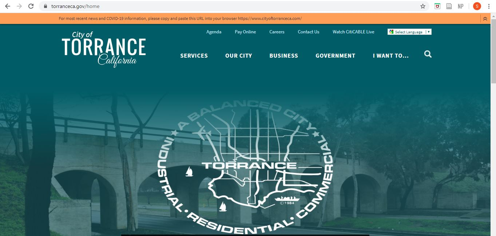
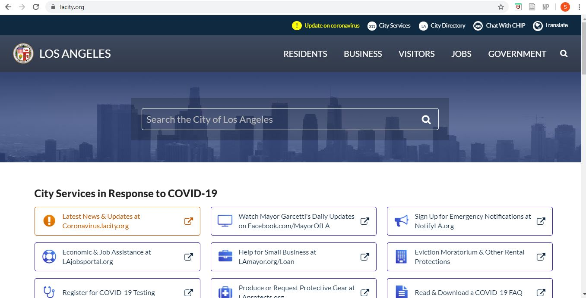

# DH150-Sean
Heuristic evaluation by Sean Geber, student in DH 150 - UX Design

## Motivation
I will be performing a heuristic examination of the government websites for my hometown, the city of Torrance, and a place that I also call home, the city of Los Angeles. These cities have shaped my worldview and overall character, and I want to show my gratitude by helping to improve their websites to serve as a better resource for their inhabitants, including myself.

City of Torrance homepage

http://torranceca.gov

City of Los Angeles homepage

http://lacity.org
